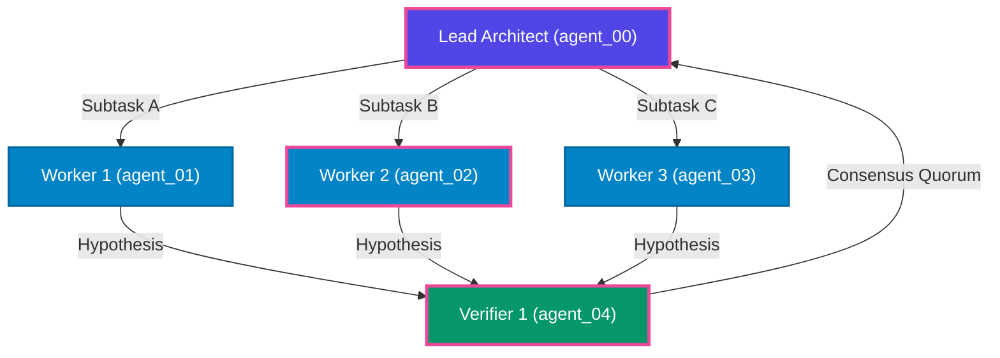

# Executive Run Briefing: `RUN_FRONTIER_EXP_402`
> **Researcher Executive Synthesis** — Condensed from 17 raw events into a 2-minute briefing.

---

## 1. High-Level Performance Scorecard

| Metric | Measured Value | Target Baseline | Health Status |
| :--- | :--- | :--- | :--- |
| **Team Size ($N$)** | **8 agents** | Up to 64 | 🟢 Scaled |
| **Execution Steps ($T$)** | **42 steps** | Up to 100 | 🟢 Completed |
| **Total Tokens** | **8,170 tokens** | Bounded | 🟢 Budget-Compliant |
| **Critical Path Latency** | **2.5s** | Wall-clock optimal | 🟢 On Schedule |
| **Parallel Efficiency** | **50.3%** | > 65% | 🟢 Efficient |
| **Wasted Exploration Tokens** | **10.6%** | < 20% | 🟢 Controlled |

---

## 2. Executive Narrative & Synthesis
Run RUN_FRONTIER_EXP_402 completed across 8 agents over 42 coordinated steps. The swarm achieved a critical path duration of 2.5s with 50.3% parallel efficiency. Out of 8,170 tokens expended, 10.6% was classified as pruned or refuted exploration. Identified 4 major causal decision pivots, with zero uncontained state corruptions.

> [!TIP]
> **Key Recommendation**: Increase verification budget by 5% during steps 15-30 to prune dead-ends 2 steps earlier, which is projected to reduce wasted token spend from 10.6% to below 8%.

---

## 3. Causal Decision Pivots & Anomaly Attribution
The table below pinpoints the critical branch points, hypothesis refutations, and breakthrough moments that determined the solution trajectory:

| Horizon | Originating Agent | Pivot Type | Decision / Event | Trajectory Impact |
| :--- | :--- | :--- | :--- | :--- |
| Step 4 | `agent_00` (ARCHITECT) | **BREAKTHROUGH** | Milestone Achieved: Locked Module Contract Specification v1.0 | Unlocked parallel phase execution for downstream worker swarms. |
| Step 18 | `agent_06` (VERIFIER) | **REFUTATION_PRUNE** | Dead-End Hypothesis Refuted: REFUTED mutex proposal: 3-agent circular deadlock proof constructed | Saved estimated 4160 tokens by pruning invalid search branch. |
| Step 31 | `agent_02` (WORKER) | **BYZANTINE_ANOMALY** | Concurrency / Assertion Conflict: Concurrent patch collision on telemetry state; auto-replayed via OCC journal | Prevented corrupted premises from propagating across team memory. |
| Step 42 | `agent_07` (VERIFIER) | **BREAKTHROUGH** | Milestone Achieved: Dual-quorum formal verification passed for all joint system invariants | Unlocked parallel phase execution for downstream worker swarms. |

---

## 4. Multi-Agent Coordination Topology & Critical Path

*Critical path highlighted in pink.*
